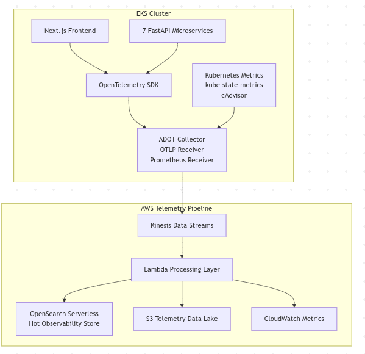

# Telemetry Pipeline Design

## Overview
The observability system collects telemetry across three layers: infrastructure, application, and product usage. Each layer captures a different aspect of system behavior but shares a unified telemetry pipeline built around ADOT, Kinesis, and Lambda processing. 

After processing, telemetry is routed to appropriate storage systems depending on the operational use case.

## Infrastructure Telemetry Layer

Infrastructure telemetry is collected using **Prometheus-compatible scraping via AWS Distro for OpenTelemetry (ADOT)**.

#### Metric Sources
- Kubernetes infrastructure metrics collected from:
  - `kube-state-metrics`
  - `cAdvisor`
  - Service `/metrics` endpoints
- Key Kubernetes telemetry includes:
  - Pod CPU and memory utilization
  - Request latency percentiles (`p50`, `p95`, `p99`)
  - Service error rates
- AWS managed service metrics integrated via **CloudWatch**, including:
  - Aurora connection pool utilization
  - Redis cache hit rates
  - OpenSearch query latency

#### Telemetry Collection Pipeline
- Metrics are scraped by the **ADOT Collector** using the Prometheus receiver.
- Collected telemetry is streamed into **Amazon Kinesis Data Streams** for scalable ingestion.
- A **Lambda processing layer** performs:
  - Metric schema normalization
  - Context enrichment (service name, environment, region, etc.)
  - Routing to downstream storage and analytics systems.

#### Design Rationale
- Uses **Prometheus-compatible metrics**, the industry standard for Kubernetes observability.
- Integrates with **AWS-native services** for scalable ingestion and processing.
- Enables centralized telemetry aggregation for monitoring, alerting, and operational insights.

## Application Telemetry Layer

Application telemetry captures **service-level behavior and workflow execution** within the platform’s microservices.

#### Instrumentation
- Each **FastAPI** service is instrumented using the **OpenTelemetry SDK**.
- Services emit structured telemetry including:
  - API request latency
  - HTTP status codes
  - Workflow step transitions
  - Retry counts
  - AI model metrics:
    - Inference latency
    - Token usage

#### Telemetry Pipeline
- Telemetry data is exported via **OpenTelemetry Protocol (OTLP)** to the **ADOT Collector**.
- The collector aggregates telemetry across services.
- Events are streamed into **Amazon Kinesis Data Streams**.
- A **Lambda processing layer** performs:
  - Schema normalization
  - Context enrichment
  - Derived metric generation

#### Derived Metrics
- Workflow execution duration
- Workflow failure rates
- Service latency trends
- Retry frequency

#### Design Rationale
- **OpenTelemetry** provides standardized instrumentation across services.
- Enables consistent service-level observability.
- Supports debugging, performance monitoring, and workflow analysis.

---

## Product Usage Telemetry Layer

Product telemetry captures **user interaction and workflow behavior** across the platform.

#### Event Sources
- The **Next.js frontend** emits structured telemetry events using a lightweight instrumentation SDK.
- Events capture user behavior such as:
  - Module dwell time
  - Workflow completion rates
  - Mini-app abandonment points
  - Natural language query patterns
  - Client-side errors

#### Telemetry Pipeline
- Events are sent to a **telemetry ingestion endpoint**.
- Data is streamed through **Amazon Kinesis Firehose**.
- Events enter the central telemetry pipeline for processing.
- A **Lambda processing layer** performs:
  - Event aggregation
  - Schema standardization
  - Derived metric computation

#### Derived Metrics
- Workflow completion rates
- Workflow abandonment rates
- Task aging statistics
- User interaction patterns

#### Design Rationale
- Provides visibility into **real user behavior**.
- Enables engineering teams to identify:
  - Usability issues
  - Workflow bottlenecks
  - Product performance problems
- Supports data-driven product improvements.

---

## Telemetry Storage and Retention

After processing, telemetry is routed to different storage systems based on its operational purpose.

| Storage System      | Purpose                             | Example Data                                 | Retention Period |
| ------------------- | ----------------------------------- | -------------------------------------------- | ----------------- |
| CloudWatch Metrics   | Monitoring and alerting            | CPU usage, error rates, latency metrics     | Up to 15 months   |
| OpenSearch           | Short-term debugging and investigation | Service logs, workflow events, error traces | 14–60 days        |
| Amazon S3 (Data Lake) | Long-term analytics and historical analysis | Raw telemetry events, usage telemetry        | 1–3+ years        |
