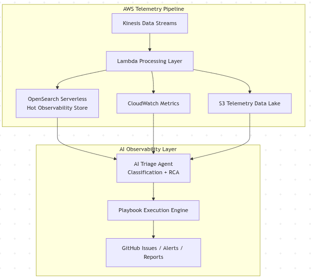
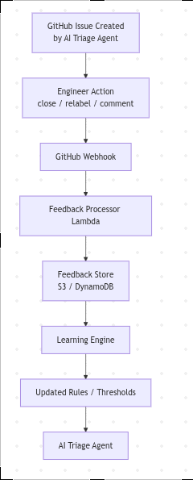

# AI Triage Agent Design


## Overview

The AI layer acts as a **virtual SRE assistant** that continuously monitors telemetry signals and executes operational playbooks automatically.



---

## 1. AI Triage Agent

The AI triage agent is triggered through three mechanisms:

- **CloudWatch Alarms** – real-time incident detection (fastest)
- **Telemetry stream events** – near real-time anomaly signals
- **Scheduled anomaly scans** – long-term trend detection

---

### Classification

Each anomaly is classified into one of four categories.

| Type | Meaning | Action |
|-----|------|------|
| Incident | Outage or severe failure | Trigger remediation playbook |
| Degradation | Performance regression | Create investigation issue |
| Insight | Product behavior pattern | Add to weekly digest |
| Noise | Non-actionable signal | Ignore |

---

### Example Classification Logic

```python
if restart_loop_detected:
    classification = "incident"

elif latency > 2 * baseline:
    classification = "degradation"
```

---

### Root Cause Analysis (AI Step)

Before triggering automation, the AI agent gathers operational context.

**Evidence collected**

- Recent deployment history
- Upstream service latency
- Container logs
- Kubernetes events
- Dependency health status

An LLM can summarize the findings:

```
Likely cause: recent deployment introduced memory leak
Impact: workflow-api latency increased 3x
Suggested action: rollback deployment
```

---

## 2. Playbook Execution Engine

Once classified, the AI agent selects the appropriate remediation playbook.

### Signal → Playbook Mapping

| Signal | Playbook |
|------|------|
| pod_restart_loop | pod-restart-loop |
| latency_spike | service-latency-investigation |
| certificate_expiry | tls-renewal |
| db_connection_exhaustion | scale-db-replicas |

### Execution Actions

The playbook engine may perform:

- `kubectl` diagnostics
- Automated remediation actions
- GitHub issue creation
- Engineer notifications

---

## 3. Outputs

The AI agent produces several operational outcomes.

### Incident

- Triggers remediation playbook
- Opens GitHub issue
- Alerts on-call engineer

### Degradation

- Opens investigation issue
- Attaches diagnostic evidence

### Insight

- Recorded in weekly engineering digest

### Noise

- Automatically suppressed

---

## Learning From Human Feedback

The AI triage agent incorporates a **feedback learning loop** by observing how engineers interact with automatically created GitHub issues.



### Feedback Signals

GitHub webhook events capture engineer actions such as:

- Closing issues
- Modifying labels
- Adjusting severity levels

These events are processed and stored as structured feedback signals.

### Continuous Learning

A periodic learning job analyzes this dataset to compute:

- False positive rates
- Classification adjustments
- Updated anomaly detection thresholds

### Outcome

Over time, this feedback loop enables the system to:

- Reduce alert noise
- Improve anomaly classification accuracy
- Align automated triage decisions with real engineering judgment
