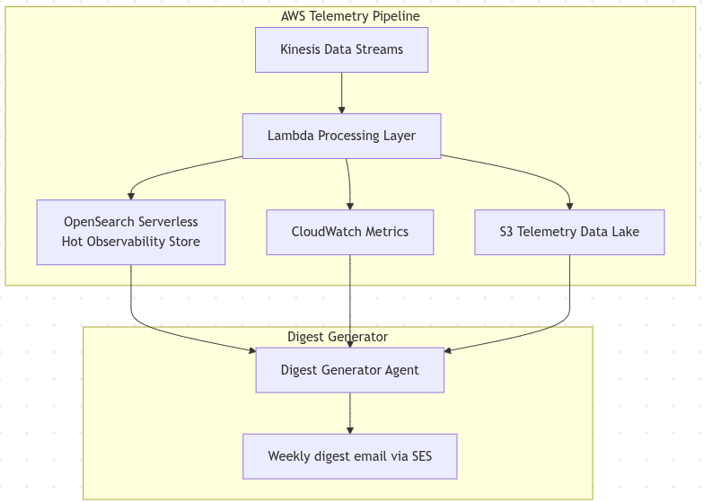

# Feature Team Insights Digest 

The Feature Team Insights Digest provides a **weekly summary of product usage, system performance, and operational signals** to engineering teams. Its purpose is to ensure that insights from telemetry data are regularly surfaced to developers so they can improve reliability and product experience.

# Digest Generator Agent

The Digest Generator Agent is responsible for aggregating telemetry data from multiple observability storage systems and generating a structured weekly report.

## Data Sources

The agent pulls summarized data from the following telemetry stores:

- **OpenSearch Serverless (Hot Observability Store)**
  - Recent operational signals
  - Error spikes and incident trends
  - Service latency anomalies

- **CloudWatch Metrics**
  - Infrastructure performance metrics
  - API latency percentiles
  - Error rate trends
  - Resource utilization

- **S3 Telemetry Data Lake**
  - Long-term product usage telemetry
  - Workflow completion statistics
  - Feature adoption metrics
  - User behavior patterns

These sources are populated earlier in the telemetry pipeline via **Kinesis Data Streams** and the **Lambda Processing Layer**, which normalize and enrich telemetry events.

---

## Digest Generation Process

The digest generator runs on a **weekly scheduled job (every Monday morning)**.

The process consists of several steps:

1. **Data Aggregation**

   The agent queries telemetry stores to collect weekly aggregates such as:

   - Most used product modules
   - Average workflow completion times
   - Error rates by service
   - Latency trends across APIs
   - Abandonment points in product workflows

2. **Insight Extraction**

   The agent analyzes aggregated data to identify patterns such as:

   - Significant increases in feature usage
   - Latency regressions
   - Frequently failing workflows
   - Newly emerging user behavior trends

3. **LLM-Assisted Summarization**

   An AI model generates a concise engineering summary, for example:

        Key Insight:
        Document analysis module usage increased by 38% this week.

        Reliability Concern:
        workflow-api latency p95 increased from 420ms to 980ms after deployment.

        Product Observation:
        27% of users abandon the invoice-processing workflow at step 3.

4. **Report Formatting**

The generated insights are structured into a digest containing:

- **User Behavior Summary**
- **Reliability Signals**
- **Workflow Performance Metrics**
- **Actionable Insights for Engineering Teams**

---

### Delivery

Once generated, the digest is distributed automatically:

- **Email delivery via Amazon SES**
- Optional **Slack channel notifications**
- Stored as a historical record for trend comparison

This automated reporting loop ensures that telemetry insights are continuously fed back into the development process, enabling engineering teams to proactively improve both **system reliability and product usability**.
